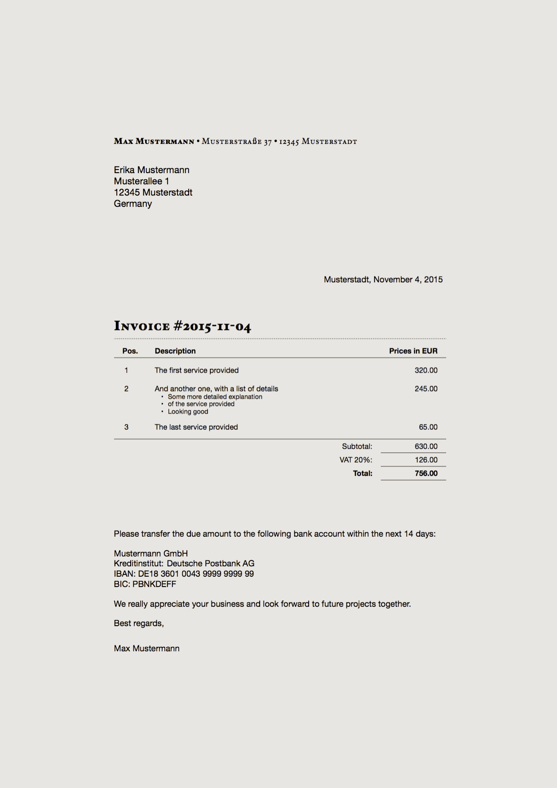

# Invoice Boilerplate

Simple automated LaTeX invoicing system for freelancers.

## Intro

Built along the lines of [cv-boilerplate](https://github.com/mrzool/cv-boilerplate) and [letter-boilerplate](https://github.com/mrzool/letter-boilerplate), this boilerplate contains the bare minimum to produce a professional-looking invoice with the least possible effort, so you can concentrate on things that matters.



The invoice content lives in `details.yml` and it's structured like so:

```YAML
invoice-nr: 2015-11-04
author: Max Mustermann
city: Musterstadt
from:
- Musterstraße 37
- 12345 Musterstadt
to:
- Erika Mustermann
- Musterallee 1
- 12345 Musterstadt
- Germany
VAT: 20
service:
- description: The first service provided
  price: 450.00
- description: And another one, with a list of details
  price: 245.00
  details:
    - Some more detailed explanation
    - of the service provided
    - Looking good
- description: The last service provided
  price: 245.00
```

When running `make`, [Pandoc](http://pandoc.org/) starts iterating on the YAML file, populates `template.tex` with your data, and pipes the result to XeTeX. XeTeX deals with the typesetting and compiles a PDF ready to be printed/faxed/emailed and archived (see the [output](output.pdf)).

The math gets handled internally by LaTeX through the `spreadtab` package, Excel-style (mad props to [clemens](http://tex.stackexchange.com/users/5049/clemens) on TeX SE for helping me out with this). You just need to provide a VAT rate and your prices, the boilerplate takes care of the rest.

Unless you plan to edit the template, no particular LaTeX knowledge is required to use this boilerplate. If you need your invoice in a language other than English, finding the relevant strings in `template.tex` and translating them to your language should be easy enough.

## Dependencies

1. LaTeX with the following extra packages: `fontspec` `geometry` `ragged2e` `spreadtab` `fp` `xstring` `arydshln` `hhline` `titlesec` `enumitem` `xunicode` `xltxtra` `hyperref` `polyglossia` `wallpaper` `footmisc`
2. [Pandoc](http://pandoc.org/), the universal document converter.

To install LaTeX on Mac OS X, I recommend getting the smaller version BasicTeX from [here](https://tug.org/mactex/morepackages.html) and installing the additional packages with `tlmgr` afterwards. Same goes for Linux: install `texlive-base` with your package manager and add the needed additional packages later.

To install pandoc on Mac OS X, run `brew install pandoc`. To install it on Linux, refer to the [official docs](http://pandoc.org/installing.html).

## Getting started

1. Open `details.yml` with your text editor and fill it with your details, the invoice recipient's details, services/prices, and the desired settings.
2. Run `make` to compile the PDF.

**Note**: this template needs to be compiled with XeTeX.

### Note for Windows users

Although I didn't test it, you can probably use this on Windows, too. Both [Pandoc](http://pandoc.org/installing.html) and LaTeX can be installed on Windows (I recommend [MiKTeX](http://miktex.org/) for that) and you should be able to run makefiles on Windows through [Cygwin](https://www.cygwin.com/). If that's too much hassle, this command should do the trick in Powershell:

    pandoc details.yml -o output.pdf --template=template.tex --pdf-engine=xelatex

## Available settings

- **`VAT`**: Your VAT rate.
- **`currency`**: Your currency code (USD, EUR...)
- **`commasep`**: Set to `true` to use a comma as decimal separator. This is for display purposes only—remember to always use a dot to set the prices in your YAML file.
- **`lang`**: Sets the main language through the `polyglossia` package. This is important for proper hyphenation and date format.
- **`seriffont`**: Used for the heading and the sender address. Hoefler Text is the default, but every font installed on your system should work out of the box (thanks, XeTeX!)
- **`sansfont`**: Used to render the recipient address, the table and the closing note. Defaults to Helvetica Neue.
- **`fontsize`**: Possible values here are 10pt, 11pt and 12pt.
- **`geometry`**: A string that sets the margins through `geometry`. Read [this](https://www.sharelatex.com/learn/Page_size_and_margins) to learn how this package works.
- **`closingnote`**: This gets printed after the table as a closing note. Use it to provide your bank details and a thank you message.
- **`letterhead`**: include custom letterhead in the PDF (see below).

## Custom letterhead

If you have already designed your own letterhead and want to use it with this template, including it should be easy enough. Set the `letterhead` option to `true` to activate the `wallpaper` package in the template. `wallpaper` will look for a file named `letterhead.pdf` in the project root folder and print it on the PDF before compiling the document. Change the fonts to match the ones in your letterhead, adjust the margins with `geometry` and you should be all set.

## Recommended readings

- [Typesetting Automation](http://mrzool.cc/writing/typesetting-automation/), my article about this project with in-depth instructions and some suggestions for an ideal workflow.
- [Grids of Numbers Recommendations](http://practicaltypography.com/grids-of-numbers.html) on Butterick's Practical Typography
- [Why Microsoft Word must Die](http://www.antipope.org/charlie/blog-static/2013/10/why-microsoft-word-must-die.html) by Charlie Stross
- [The Beauty of LaTeX](http://nitens.org/taraborelli/latex) by Dario Taraborelli

## Resources

- Refer to [pandoc's documentation](http://pandoc.org/MANUAL.html#templates) to learn more about how templates work.
- If you're not familiar with the YAML syntax, [here](http://learnxinyminutes.com/docs/yaml/)'s a good overview.
- If you want to edit the template but LaTeX scares you, these [docs](https://www.sharelatex.com/learn/Main_Page) put together by ShareLaTeX cover most of the basics and are surprisingly kind to the beginner.
- Odds are your question already has an answer on [TeX Stack Exchange](https://www.sharelatex.com/learn/Main_Page). Also, pretty friendly crowd in there.
- Need to fax that invoice? Check out [Phaxio](https://www.phaxio.com/) and learn how to send your faxes from the command line with a simple API call.

## See also

- [cv-boilerplate](https://github.com/mrzool/cv-boilerplate) — Easing the process of building and maintaining a CV using LaTeX
- [letter-boilerplate](https://github.com/mrzool/letter-boilerplate) — Typeset your important letters without leaving your text editor

## License

[GPL](http://www.gnu.org/licenses/gpl-3.0.txt)
